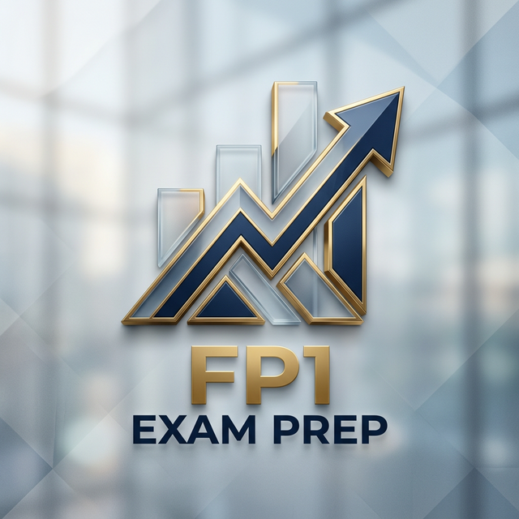

# FP1 Exam Preparation Repository

This repository contains study materials and resources for the **Financial Planner Grade 1 (FP1) Examination**. 

## 📂 Project Structure

- **[不動産](不動産)**: Real Estate, property taxes, and related laws.
- **[相続事業承継](相続事業承継)**: Inheritance, Business Succession, and Estate Planning.
- **[launcher.html](launcher.html)**: A premium, Anaconda Navigator-inspired dashboard to access all modules easily.

## 🚀 Getting Started

You can access the study modules directly online via GitHub Pages:
**👉 [Open Launcher Dashboard](https://chess-r-quarto.github.io/fp1_exam/launcher.html)**

Alternatively, to run locally:
1. Open `launcher.html` in your favorite web browser.
2. Use the dashboard to navigate through different study modules.
3. Each module contains specific HTML notes and exercises.

---
*Created with ❤️ by Antigravity for FP1 Candidates.*